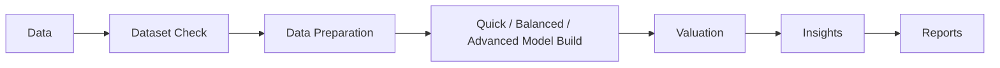

# PricePredict AI

PricePredict AI is a production-minded Real Estate Valuation & Predictive Intelligence platform built with FastAPI, Streamlit, and scikit-learn. It detects whether uploaded data actually represents property observations, distinguishes individual-property data from geographic aggregates, trains leakage-safe regression pipelines, and creates valuation inputs from the saved model schema—not from hard-coded demo fields. Streamlit is the internal analyst console; website visitors use a small script-tag widget backed by the API.

The repository retains the original California housing notebook as a reproducible learning artifact while turning the idea into a tested application with clear separation between UI, data processing, and machine learning.

## Screenshots


## Product workflow



### Capabilities

- CSV validation, schema inference, missingness and cardinality profiling
- Real-estate vs generic-regression domain detection with transparent confidence scores
- Property ontology mapping for residential, rental, land, and commercial datasets
- Prediction-granularity classification, including honest California block-level labeling
- Ranked valuation-target detection with explicit currency selection
- Data Quality and Valuation Suitability scores with visible component metrics
- Automatic target-leakage, identifier, duplicate, invalid-value, and outlier warnings
- Per-column imputation, optional training-only IQR capping, and scaling
- A centralized 25+ model catalog spanning linear, robust, polynomial, kernel, tree, boosting, neural, probabilistic, and ensemble regression
- Dataset-aware eligibility with visible exclusions for unsuitable scale, dimensionality, run mode, or missing optional packages
- User Mode by default with Quick, Balanced, and Advanced model builds; Expert Mode reveals model science and engineering controls
- Two-stage AutoML: consistent cross-validated screening followed by focused randomized optimization of top finalists
- Automatic shuffled, grouped-property, chronological, or explicit geographic validation with matching holdout design
- Configurable composite ranking across predictive performance, fold stability, model simplicity, and generalization, including sensitivity analysis
- R², RMSE, MAE, median absolute error, conditional MAPE, explained variance, timing, residuals, and fold-level stability diagnostics
- Optional XGBoost, LightGBM, and CatBoost integration with graceful package-availability reporting
- Voting, cross-validated stacking, and CV-weighted blends accepted only when validation improvement clears an evidence threshold
- Model-native or permutation feature importance and local SHAP explanations
- Persisted model schema contracts with feature order, types, labels, groups, vocabularies, ranges, and imputation metadata
- Dynamically grouped valuation forms with explicit unknown/imputed inputs
- Model-based uncertainty ranges, heuristic Model Confidence Scores, and similar historical records when justified
- Contract-validated batch prediction with valid/invalid row counts and schema warnings
- Versioned model IDs, model cards, trusted local registry, and downloadable valuation reports
- Session-persistent multi-page workflow and bundled California housing demo
- Six causally structured synthetic markets with deterministic seeds, configurable market assumptions, and downloadable manifests
- MCAR/MAR/feature-dependent missingness, valid/impossible outliers, duplicates, leakage, and distribution-shift scenarios
- Persisted benchmark tables with AutoML regret, runtime, failures, ground-truth driver recovery, and robustness evidence
- Structured BLOCKER/HIGH/MEDIUM/LOW fault findings with recommended recovery actions
- Tenant-isolated durable dataset, schema-contract, model-card, prediction, job, and consented-lead records
- FastAPI endpoints for ingestion, training, model/schema discovery, publication, single/batch prediction, customer self-service, and deletion
- API-key protected operator workflows, fixed-window abuse controls, configurable CORS, and structured request logs
- Embeddable JavaScript widget whose fields reshape from the active model contract without a frontend redeploy
- Data-driven locality alias reference, explicit customer retention, and scheduled retraining/drift hooks

## Architecture

```text
app/                    Streamlit pages and reusable UI components
backend/                FastAPI delivery layer and embeddable JavaScript widget
src/data/               CSV loading, profiling, and preprocessing
src/domain/             Domain detection, property ontology, target intelligence
src/features/           Feature recommendations and engineering helpers
src/models/             Training, registry, explainability, and prediction
src/benchmark/          Synthetic markets, corruptions, fault diagnostics, benchmark persistence
src/validation/         Persisted model contracts and prediction validation
src/platform/           Tenant isolation, durable SQL records, ingestion/training services, retention and retraining
src/reports/            Downloadable valuation reports
src/utils/              Application configuration and schema validation
data/sample_datasets/   Bundled demonstration dataset
data/benchmarks/         Reproducible benchmark evidence and manifests
scripts/                 Validation-matrix, robustness, shift, and explainability runners
models/                 Session-keyed fitted pipeline artifacts
tests/                  Unit and integration tests
```

All imputers, encoders, outlier bounds, and scalers are fitted inside `sklearn.Pipeline` / `ColumnTransformer` objects. Cross-validation therefore learns preprocessing only from each training fold and avoids leakage into validation or holdout data.

## Dataset intelligence and operating modes

The application scores semantic signals from column names, data types, cardinality, feature co-occurrence, location fields, property characteristics, and valuation targets.

- **Real Estate Intelligence** activates property-aware language, asset classification, suitability scoring, grouped valuation inputs, and comparable analysis where the granularity supports it.
- **Generic Regression Mode** remains available for unrelated tabular data, but deliberately disables property valuation claims.
- A property dataset without a recognized historical price/value/rent target is placed in analytics-only state until the user supplies an appropriate target dataset or switches modes.

Raw columns are never renamed or overwritten. The application maintains a traceable chain: raw schema → normalized ontology roles → selected model schema → persisted prediction contract.

## Supported real-estate patterns

- Residential apartments, flats, villas, houses, studios, and listings
- Land parcels, plots, zoning/frontage datasets
- Commercial offices, retail, warehouses, and lease datasets
- Rental units and monthly/annual rent targets
- Geographic or census/block aggregates, clearly labeled as area-level estimates

Columns may be absent. The model trains only on selected fields that actually exist and never fabricates parking, rooms, coordinates, age, amenities, or other unavailable property concepts.

## Target detection and leakage prevention

Potential targets such as sale price, listing price, transaction value, rent, price per area, and median housing value are ranked and explained. Suspicious price-derived inputs, near-perfect target proxies, post-sale fields, and entity IDs are flagged before training. Model selection uses a documented composite of cross-validated predictive performance (60%), fold stability (20%), simplicity (10%), and generalization (10%). The holdout set remains a diagnostic and is not used to tune hyperparameters.

## Prediction contract

Every trained artifact stores feature names/order, original data types, ontology roles, UI groups and labels, numeric ranges, categorical vocabularies, missingness and imputation behavior, target/currency, domain, asset type, granularity, metrics, quality scores, limitations, and training configuration. Single and batch prediction validate against this contract. Missing inputs stay missing and are handled by the fitted imputer; arbitrary zero defaults are never inserted.

## Uncertainty and limitations

The displayed 95% range uses finite-sample split conformal calibration on data that is disjoint from both model training and the final test set. It targets marginal coverage under exchangeability; it does not guarantee coverage for every location, property type, subgroup, or shifted future market. The Model Confidence Score combines predictive accuracy, fold stability, generalization, dataset quality, input completeness, and comparable coverage; it is a transparent heuristic, not a probability. Model performance and data reliability are displayed separately.

PricePredict AI is historical and data-dependent. It is not a legal valuation, a guaranteed market appraisal, or a substitute for a licensed appraiser where one is required. Geographic aggregate datasets cannot justify exact individual-property claims.

## Run locally

Python 3.11 or newer is required.

```bash
python -m venv .venv
# Windows
.venv\Scripts\activate
pip install -r requirements.txt
streamlit run app/main.py
```

Open `http://localhost:8501`. The default lifecycle is **Data → Data Preparation → Model → Valuation → Insights → Reports**. Enable **Expert Mode** for the synthetic benchmark, model science, system health, and platform API views.

### Run the API and widget

Set a strong operator secret; the API intentionally returns `503` for protected routes when no key is configured.

```powershell
$env:PRICEPREDICT_API_KEY="replace-with-a-long-random-secret"
$env:ALLOWED_ORIGINS="https://www.example-real-estate-site.com"
python -m uvicorn backend.api:app --host 127.0.0.1 --port 8765
```

API documentation is available at `http://127.0.0.1:8765/docs`. Uploads use the raw CSV/XLSX request body and a `filename` query parameter, avoiding multipart parser coupling. An operator confirms the target explicitly in `/train`; the service never silently chooses among multiple price-like targets.

Embed a published model on an existing website:

```html
<div id="pricepredict-widget"></div>
<script src="https://valuation.example.com/widget.js"
        data-api="https://valuation.example.com"
        data-tenant="operator"
        data-model="PP-RES-..."
        data-mount="pricepredict-widget"></script>
```

The widget fetches `/schema`, builds the form from the deployed prediction contract, and displays the point estimate, calibrated range, non-probabilistic confidence heuristic, model version, granularity caveat, and legal disclaimer.

Customer comparable uploads use `/customer/datasets`, `/customer/train`, and `/customer/predict` with a strong `X-Session-Token`. The server derives the tenant boundary from that token; customer data and artifacts are retained for 24 hours unless deleted earlier. Contact data is accepted only with explicit consent and a disclosed 1–365 day retention period. Run `python -m scripts.run_scheduled_retraining --tenant TENANT --execute` from a scheduler to enforce expired-record cleanup and retraining cadence.

## Run tests

```bash
python -m pytest -q
```

## Reproduce engineering evidence

```bash
python -m scripts.run_validation_matrix
python -m scripts.run_shift_benchmark
python -m scripts.run_robustness_validation
python -m scripts.run_explainability_validation
python -m scripts.run_multiseed_selection_validation
python -m scripts.run_full_model_zoo_benchmark
```

These commands write CSV/JSON evidence under `data/benchmarks/`. Synthetic validation tests software and methodology under controlled assumptions; it does not establish real-world appraisal accuracy.

## Current benchmark evidence

- Full California Housing (20,640 rows): Histogram Gradient Boosting, holdout R² `0.819`, holdout RMSE approximately `48,726`.
- A six-seed mixed-residential audit measured AutoML holdout regret of `0.28%`–`25.26%` (mean `10.24%`, median `8.55%`). Holdout is audit-only and this variance is explicitly reported as a model-selection limitation.
- A controlled 20% target-market shift increased matched-row RMSE by approximately `45%`–`81%`, depending on market type. Exact routing and OOD checks therefore remain mandatory.
- Explainability recovery achieved rank correlation `0.75` and recovered all three expected top drivers after continuous measurements were restored to feature selection. Synthetic recovery is not causal proof.
- The 200-row full-zoo benchmark produced 23 successful models, two dimensionality exclusions, and one safely unavailable LightGBM binary detected by isolated realistic preflight. Voting, weighted blending, and stacking were rejected because they degraded validation RMSE. Full-zoo AutoML regret was `3.13%`.
- Final automated verification: `72 passed`; all 11 Streamlit routes rendered without uncaught exceptions.

## Docker

```bash
docker build -t price-predict-ai .
docker run --rm -p 8501:8501 price-predict-ai
```

To run the API and admin console together with shared durable storage:

```bash
cp .env.example .env
docker compose up --build
```

The bundled durable SQL store is appropriate for a single-node capstone/pilot. Before multi-instance internet deployment, migrate the persistence adapter to managed PostgreSQL and object storage, and replace the in-process rate limiter with a shared Redis-backed limiter.

## Modeling notes

- The target is never included in preprocessing features.
- Rows with missing targets are removed; feature missingness is handled in the fitted pipeline.
- A log-target option uses `TransformedTargetRegressor`, so displayed predictions remain on the original scale.
- The 95% range is split-conformal calibrated; six-seed final-test coverage averaged `94%`. This is a marginal, exchangeability-based result rather than a conditional or shifted-market guarantee.
- High-cardinality text is flagged during profiling. Users can intentionally retain it, with unseen categories safely ignored by one-hot encoding.
- Saved joblib files must only be loaded from trusted sources because pickle-family formats can execute code during deserialization.

## Original analysis

The original `15_4_house_price_prediction.ipynb` and `houseprediction.csv` remain at repository root. Its fixed `predict_house_price(...)` helper is explicitly labeled as a California block-level educational demonstration and is not used by production inference. The application uses a copy at `data/sample_datasets/housing_sample.csv` as its bundled geographic/block-level demo.
