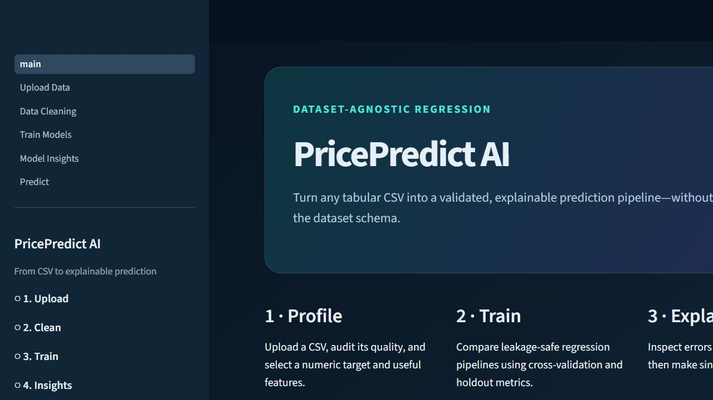
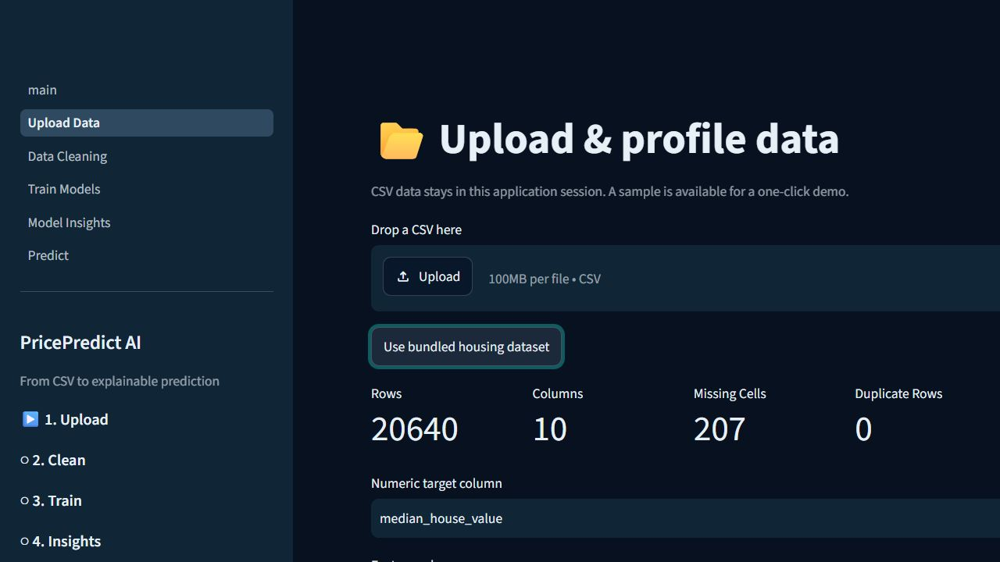

# House Price Prediction

Supervised regression and real-estate valuation platform for predicting residential property prices from structural, location, quality, and market-context features. The project goes beyond a notebook: it includes dataset validation, feature engineering, leakage-safe model training, model comparison, cross-validated evaluation, Streamlit analysis workflows, a FastAPI prediction layer, and reproducible benchmark evidence.

**Best verified benchmark model:** `Histogram Gradient Boosting` - CV RMSE `48,749` | holdout RMSE `48,726` | holdout R2 `0.819` on the full California Housing benchmark. The held-out test set is scored once; cross-validation is used for model screening and selection.

---

## Results

| Evaluation scope | Best / selected model | CV RMSE | Test RMSE | Test MAE | Test R2 |
| --- | --- | ---: | ---: | ---: | ---: |
| California Housing full benchmark | Histogram Gradient Boosting | 48,749 | 48,726 | Reported in app run | 0.819 |
| Noida synthetic listings QA run | Ridge | INR 4.01M | INR 11.29M | INR 2.80M | 0.500 |
| Full 200-row model-zoo benchmark | Lasso selected; ensembles rejected | See benchmark files | See benchmark files | See benchmark files | See benchmark files |

> Metrics are generated through cross-validated model screening with a final holdout audit. Synthetic validation tests software behavior and methodology; it is not real-market appraisal proof.





---

## Workflow

```text
data/sample_datasets/housing_sample.csv
        |
        v
[1] Dataset intelligence       -> src/domain/, src/data/
        |   real-estate detection, target discovery, granularity, schema profiling
        v
[2] Cleaning and validation    -> src/data/, src/validation/
        |   missing values, leakage checks, identifiers, invalid values, outliers
        v
[3] Feature engineering        -> src/features/, sklearn ColumnTransformer
        |   numeric/categorical handling, datetime promotion, scaling, encoding
        v
[4] Model training             -> src/models/trainer.py
        |   baseline, regularised, robust, tree, boosting, neural, ensemble candidates
        v
[5] Evaluation and reporting   -> src/models/, src/reports/, app/
            RMSE, MAE, R2, residuals, uncertainty, explainability, model cards
```

Run the Streamlit app:

```bash
git clone https://github.com/Anjaney336/House-prediction.git
cd House-prediction
pip install -r requirements.txt
streamlit run app/main.py
```

Run the API:

```powershell
$env:PRICEPREDICT_API_KEY="replace-with-a-long-random-secret"
$env:ALLOWED_ORIGINS="https://www.example-real-estate-site.com"
python -m uvicorn backend.api:app --host 127.0.0.1 --port 8765
```

Run tests:

```bash
python -m pytest -q
```

---

## Dataset

**Primary source:** California Housing dataset, bundled as `houseprediction.csv` and `data/sample_datasets/housing_sample.csv`  
**Shape:** `20,640` rows x `9` columns  
**Target:** `MedHouseVal`, median house value for a California census block group  
**Committed?** Yes, the sample dataset is committed for reproducible local demos.

The repository also includes small synthetic/property samples to test residential listings, missing-target cases, unrelated schemas, and API/customer workflows.

### Key features

| Column | Type | Description |
| --- | --- | --- |
| `MedInc` | numeric | Median income in the block group; strongest California benchmark signal. |
| `HouseAge` | numeric | Median age of houses in the block group. |
| `AveRooms` | numeric | Average number of rooms per household. |
| `AveBedrms` | numeric | Average number of bedrooms per household. |
| `Population` | numeric | Block-group population. |
| `AveOccup` | numeric | Average household occupancy. |
| `Latitude` / `Longitude` | numeric | Geographic position used for location-sensitive valuation. |
| `price_inr` | numeric | Target used only in the Noida synthetic QA dataset. |
| `property_type`, `city`, `locality` | categorical | Property descriptors used in individual-property synthetic/listing workflows. |

Full column notes are in `docs/data_dictionary.md`.

### Preprocessing decisions

- Missing values: numeric features are imputed inside fitted scikit-learn pipelines; categorical features use fitted categorical handling rather than hard-coded defaults.
- Outliers: optional training-only IQR capping is available and learned without validation leakage.
- Target handling: rows with missing targets are removed; log-target training is supported through `TransformedTargetRegressor` where appropriate.
- Leakage prevention: target-derived columns, identifiers, post-sale fields, near-perfect proxies, and incompatible schema fields are flagged before training.
- Validation: shuffled, grouped-property, chronological, or geographic validation is selected based on detected dataset structure.

---

## Model Coverage

| Model family | Implementation status | Notes |
| --- | --- | --- |
| Linear Regression baseline | Supported | Used for baseline comparison and sanity checks. |
| Ridge / Lasso / Elastic Net | Supported | Regularised models are useful for stable, interpretable tabular baselines. |
| Random Forest / Extra Trees | Supported | Nonlinear tree ensembles for mixed feature behavior. |
| Gradient Boosting / Histogram Gradient Boosting | Supported | Best verified California benchmark result. |
| XGBoost / CatBoost | Optional | Used when packages are available and preflight checks pass. |
| LightGBM | Safely gated | Marked unavailable when the local native binary is unstable. |
| Voting / stacking / weighted blends | Supported but evidence-gated | Rejected when validation RMSE worsens. |

---

## Architecture

```text
app/                    Streamlit analyst console and workflow pages
backend/                FastAPI delivery layer and embeddable JavaScript widget
src/data/               CSV loading, profiling, schema checks, preprocessing
src/domain/             Real-estate detection, ontology, target/currency intelligence
src/features/           Feature recommendations and engineering helpers
src/models/             Training, model catalog, registry, explainability, prediction
src/benchmark/          Synthetic markets, robustness tests, benchmark persistence
src/validation/         Model contracts and prediction validation
src/platform/           Tenant isolation, durable records, lifecycle services
src/reports/            Downloadable valuation reports
data/sample_datasets/   Demo and QA datasets
data/benchmarks/        Reproducible benchmark evidence
scripts/                Validation, robustness, shift, and explainability runners
tests/                  Unit and integration tests
```

All imputers, encoders, outlier bounds, and scalers are fitted inside `sklearn.Pipeline` or `ColumnTransformer` objects. Cross-validation therefore learns preprocessing only from each training fold and avoids leakage into validation or holdout data.

---

## Current Benchmark Evidence

- Full California Housing benchmark: Histogram Gradient Boosting, CV RMSE `48,749`, holdout RMSE approximately `48,726`, holdout R2 `0.819`.
- Noida synthetic listings QA run: Ridge, CV RMSE about INR `4.01M`, test RMSE INR `11.29M`, test MAE INR `2.80M`, test R2 `0.500`, and 92.5% empirical 95% interval coverage.
- Six-seed mixed-residential audit: AutoML holdout regret `0.28%` to `25.26%`, mean `10.24%`, median `8.55%`.
- Controlled 20% target-market shift increased matched-row RMSE by about `45%` to `81%`, depending on market type.
- Explainability recovery achieved rank correlation `0.75` and recovered all three expected top drivers after continuous measurements were restored to feature selection.
- Full model-zoo benchmark produced 23 successful models, two dimensionality exclusions, one safely unavailable LightGBM binary, and rejected ensembles when they degraded validation RMSE.
- Final automated verification: `72 passed`; all 11 Streamlit routes rendered without uncaught exceptions.

Reproduce evidence:

```bash
python -m scripts.run_validation_matrix
python -m scripts.run_shift_benchmark
python -m scripts.run_robustness_validation
python -m scripts.run_explainability_validation
python -m scripts.run_multiseed_selection_validation
python -m scripts.run_full_model_zoo_benchmark
```

---

## Platform Features

- Real-estate vs generic-regression dataset detection with transparent confidence scores.
- Residential, rental, land, and commercial property ontology support.
- Ranked target detection for sale price, listing price, rent, transaction value, and median housing value.
- Data Quality and Valuation Suitability scores with component-level diagnostics.
- Leakage, identifier, duplicate, invalid-value, and outlier warnings before training.
- User Mode for quick workflows and Expert Mode for model science, benchmarking, and platform diagnostics.
- Model cards, schema contracts, prediction validation, uncertainty ranges, and similar-record context.
- FastAPI endpoints for ingestion, training, model/schema discovery, publication, prediction, and deletion.
- API-key protected operator routes, configurable CORS, and structured request logs.
- Embeddable JavaScript widget that builds its input form from the active model contract.

---

## Docker

```bash
docker build -t price-predict-ai .
docker run --rm -p 8501:8501 price-predict-ai
```

To run the API and admin console together:

```bash
cp .env.example .env
docker compose up --build
```

---

## Limitations

- California Housing is a census/block-level dataset and must not be presented as exact individual-property appraisal evidence.
- The Noida listing dataset is synthetic QA evidence, so publication as a real production valuation model is intentionally blocked.
- Random holdouts do not fully model temporal market drift; chronological or geographic validation is preferred when data supports it.
- Split-conformal uncertainty gives marginal coverage under exchangeability, not guaranteed coverage for every location, property type, or future shifted market.
- Saved joblib files must only be loaded from trusted sources because pickle-family formats can execute code during deserialization.
- Before multi-instance internet deployment, replace local durable storage with managed PostgreSQL/object storage and use a shared rate limiter.

---

## Author

**Anjaney Malhotra** - B.Tech Mechanical Engineering, VIT Vellore  
[GitHub](https://github.com/Anjaney336)
